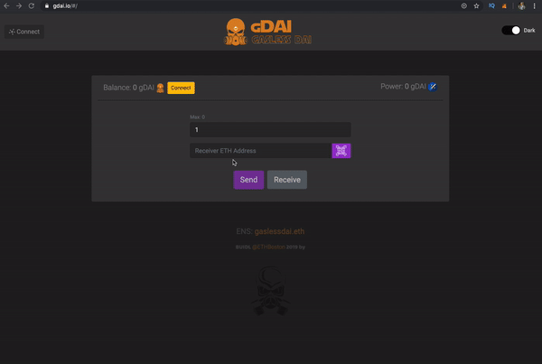

# gDAI - Gasless DAI 

## Inspiration
The main idea is to be able to send DAI without having any Ether for paying gas. Can provide better adoption with using simply interface and only gDAI for payments and token transfers.

## What it does
Sending DAI without paying for gas with Ether by using gas station network and staking on Fulcrum for earning interest for further transactions.

## How I built it
Build with common dApp technologies like Angular and Solidity.

## Challenges I ran into
Calculate the right interest rate of each user. Binding the smart contract to the Angular frontend. Integration of gas station network of OpenZeppeling.

## Accomplishments that I'm proud of
Gas station network integration!

## What I learned
Now i know how to work with gas station network and Fulcrum.

## What's next for gDAI
Hope ETHGlobal would use it on the hackathons for paying for a beer or food.

## Try it out
https://gdai.io 

